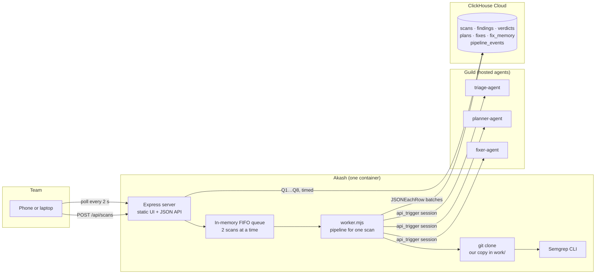
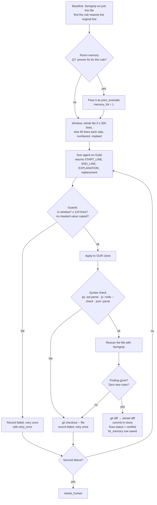
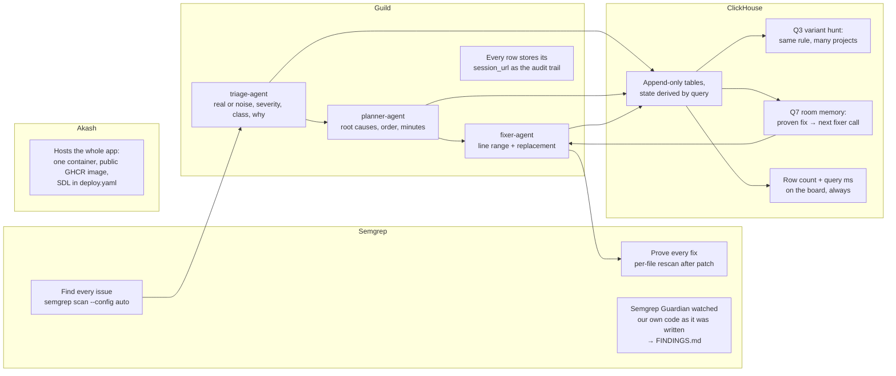
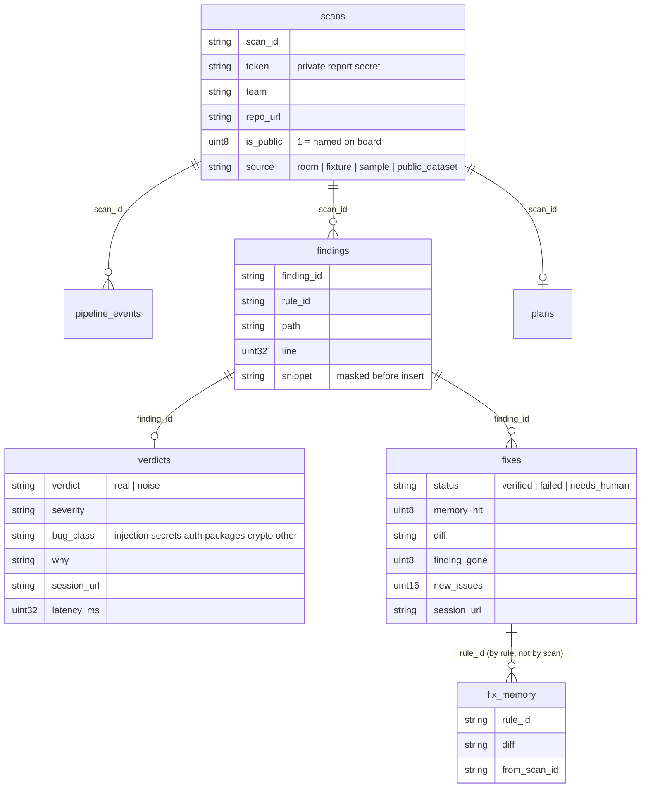

<div align="center">

# Patchwork

### Found. Fixed. Proven.

**A free, opt-in security desk for every team in a hackathon room.**
Semgrep finds the bugs. Three agents on Guild triage, plan, and patch. Every patch is applied to our copy and rescanned before anyone sees it. ClickHouse remembers every fix so the next team gets it faster.

[**Live site**](http://fnppdkvs7devtbbbtnlc32vqpc.ingress.cpu.lax.lsn.akash.pub) · [Live board](http://fnppdkvs7devtbbbtnlc32vqpc.ingress.cpu.lax.lsn.akash.pub/board.html) · [Scan my repo](http://fnppdkvs7devtbbbtnlc32vqpc.ingress.cpu.lax.lsn.akash.pub/join.html) · [History](http://fnppdkvs7devtbbbtnlc32vqpc.ingress.cpu.lax.lsn.akash.pub/history.html)

Built solo, from zero, in one afternoon at the Cyberdefense Hackathon, San Francisco, October 9, 2026.

</div>

---

## Why

Every team in the room shipped AI-written code today. Nobody reviewed it. Scanners find hundreds of things and most of them are noise. Autofix tools change code and hope. Patchwork does the three things a tired team actually needs:

1. **Tell me what is real.** A triage agent reads each finding with the code around it and says real or noise, and why, in plain words.
2. **Tell me what to fix first.** A planner groups issues by root cause and orders them: leaked secrets, then anything an outsider can reach, then the rest.
3. **Prove the fix works.** A fixer writes the smallest safe change. We apply it to our clone, check the file still parses, and rescan with Semgrep. Only patches that pass are shown. Never "guaranteed", always "verified by rescan".

And because a room full of teams makes the same mistakes, two ideas turn one repo's fix into the room's fix:

- **Variant hunt.** When a rule fires as a real issue in one project, the board shows every other project where the same rule fired. One bug here leads to the same bug in N other projects.
- **Room memory.** Every verified fix is saved by rule. The next time that rule appears anywhere, the fixer receives the proven fix as an example. Guidance, not copy and paste: each patch is still applied and rescanned on its own. These count as "memory assisted fixes" on the board.

## What a team sees

| Screen | Purpose |
|---|---|
| `/` | Landing page with live room numbers |
| `/join.html` | Paste a public GitHub link, tick "name us on the board" if you want |
| `/report.html?scan=…&t=…` | Private report: live stage, fix plan, every issue, verified diffs, one `patchwork.patch` to `git apply` |
| `/fix.html?…&f=…` | The proof screen for one fix: diff, rescan result, new issues, time to fix, Guild session links |
| `/board.html` | The room: teams by bug class, live feed, variant hunt, headline flaw, ClickHouse row count and query latency |
| `/history.html` | Every scan ever run, with counts |

## Architecture



One process, no build step, no framework. The browser polls JSON every two seconds. The container is stateless apart from the clones in `work/`; everything that matters lives in ClickHouse.

## The pipeline, step by step

```mermaid
flowchart TD
    A[Validate URL<br/>only https://github.com/owner/repo] --> B[Shallow clone<br/>depth 1, no submodules, 60 s cap, 300 MB cap]
    B --> C[Semgrep scan<br/>--config auto, whole clone]
    C --> D[Filter and rank<br/>drop vendor, dist, lockfiles, minified<br/>ERROR > WARNING > INFO]
    D --> E[Snippet<br/>12 lines each side, path contained,<br/>secrets masked before storing]
    E --> F{Triage on Guild<br/>4 in parallel, top 15}
    F -- noise --> N[Stored, shown in<br/>"findings we ruled out"]
    F -- real --> G[Plan on Guild<br/>one call with all real issues]
    G --> H[Fix and verify loop<br/>in plan order, up to 5]
    H --> I[Done<br/>private report + board update]
    N --> I
```

Every stage writes a `pipeline_events` row at start and end with its duration. That is what the live feed shows.

## The verify loop, the part that matters



The report's combined patch is `git diff <original sha> HEAD` in our clone. Teams apply it with `git apply patchwork.patch`. For leaked keys the patch moves the value to an environment variable, and the report says in red: rotate it, it is still in your git history.

## How each sponsor is used



| Sponsor | What it does here | Where a judge sees it |
|---|---|---|
| **Semgrep** | Finds everything (`--config auto`), proves every fix by rescanning the patched file, and Guardian reviewed our own code during the build. | "Findings scanned" on the board; "Rescan: finding gone" on every fix view; [FINDINGS.md](FINDINGS.md) |
| **Guild** | Hosts and runs all three agents as `llmAgent` TypeScript agents, called through one API trigger. Every verdict, plan, and fix stores its Guild session URL. | "Triage session on Guild" and "Fix session on Guild" links on each fix view |
| **ClickHouse Cloud** | The only store. Seven append-only tables, one view, every screen is a query in [queries.sql](queries.sql). Variant hunt and room memory are ClickHouse queries that directly drive remediation. | "ClickHouse: N rows, last query X ms" on the board; History page shows query time |
| **Akash** | Runs the app itself. One container from the public image `ghcr.io/techadnank9/patchwork`, deployed from [deploy.yaml](deploy.yaml). | The live URL at the top of this page |
| **Model** | Guild's managed model access (Gemini Flash at the time of the event). No model key in our code. | `backend = 'guild'` on every row |

## Data model



Append only. Nothing is updated or deleted; state is derived by query. A view, `latest_room_scans`, picks each repo's newest scan so a rescan never double counts. Only `source = 'room'` rows reach the board; the test fixture and the sample seed are labeled and excluded.

## Safety, by construction

| Rule | How it is enforced |
|---|---|
| Opt in only | A repo is scanned only when its team submitted it through the form |
| Never execute cloned code | Clone, read, Semgrep, `ast.parse`, `node --check`. No install, no build, no import |
| Repo content is data, not instructions | Every agent prompt says so; the worker never interprets file contents |
| Secrets never leave | `redact()` masks token shapes, PEM blocks, and any 20+ char value assigned to a *key/secret/token/password* name, before storing, before any agent call, before display |
| No injection | `execFile` with argument arrays, strict URL allowlist, `realpath` containment on every file read, parameterized ClickHouse queries, `textContent` only in the UI, CSP with no inline scripts |
| Private stays private | Reports need a 16-byte token; the board names only teams that ticked the box; others count toward totals only |
| Honest numbers | Sample rows are visible only with `?sample=1` under a "Sample data" banner |

"Verified by rescan" means Semgrep no longer flags the code and the file still parses. It does not prove the app behaves the same. Read every diff.

## Run it yourself

Node 22 or newer. No build step.

```bash
git clone https://github.com/techadnank9/patchwork && cd patchwork
npm install
pip install semgrep                       # or brew install semgrep
cp .env.example .env                      # ClickHouse + Guild values
node --env-file=.env scripts/init-db.mjs  # 7 tables, 1 view
node --env-file=.env server.mjs           # http://localhost:3000
```

One scan from the command line:

```bash
node --env-file=.env worker.mjs https://github.com/owner/repo "Team name" [--no-agents] [--no-fix] [--public]
node --env-file=.env worker.mjs --local fixtures/vuln-app "Fixture"   # labeled test fixture, never on the board
node --env-file=.env scripts/try-agent.mjs triage sample-input.json   # one agent call, prints the session URL
node --env-file=.env scripts/bulk.mjs repos.txt                        # queue a list of repos
node --env-file=.env scripts/seed-sample.mjs                           # sample rows for building the UI
npm test                                                               # redact() unit tests
```

### Guild agents

```bash
npm i -g @guildai/cli && guild auth login
guild workspace create patchwork && guild workspace select adnan~patchwork
# per agent, in a sibling folder:
guild agent init --name triage-agent --template LLM --agent-type GUILD_TYPESCRIPT
cp ../patchwork/agents/triage-agent/agent.ts triage-agent/agent.ts
cd triage-agent && npm install && guild agent save --message "v1" --wait --publish
guild workspace agent add adnan~triage-agent
```

The API trigger key comes from the web app only: workspace → Triggers → Add Trigger → API. It is shown once. Account API keys cannot start trigger sessions.

### Deploy

```bash
docker build -t ghcr.io/techadnank9/patchwork:latest .   # or let GitHub Actions do it on push
```

GitHub Actions builds the image on every push to master, tagged `latest` and `sha-<commit>`. Akash runs the SHA tag so providers never serve a stale `latest`. The SDL is [deploy.yaml](deploy.yaml); the two secret values are entered in the Akash console, never committed.

## Repository layout

```
server.mjs          Express, queue, API, static files
worker.mjs          pipeline for one scan, also a CLI
lib/db.mjs          ClickHouse client, batched inserts, timed queries
lib/repo.mjs        URL allowlist, shallow clone, path containment
lib/semgrep.mjs     scan a dir or a file with execFile, normalize, filter, rank
lib/redact.mjs      mask secrets before storing, sending, or showing
lib/verify.mjs      apply a fix to our clone, syntax check, rescan, diff, commit
lib/agents.mjs      runAgent wrapper that picks the backend (guild | openai fallback)
lib/guild.mjs       Guild API client and the three answer parsers
agents/             the three Guild agents (TypeScript, llmAgent)
public/             landing, board, join, report, fix, history. Plain HTML, CSS, vanilla JS.
scripts/            init-db, try-agent, seed-sample, bulk
fixtures/vuln-app   labeled test fixture, never on the board
schema.sql          the tables
queries.sql         every query behind every screen, Q1 to Q8 plus history
deploy.yaml         Akash SDL
Dockerfile          Node 22 + Semgrep + git + python3
```

## Numbers from the build

| | |
|---|---|
| Guild agent call, warm | about 50 s |
| Semgrep on the fixture | about 3 s |
| Per-file rescan | 2 to 4 s |
| Fixture fix, found to verified | 51 s and 71 s |
| Second project, same rules | both fixes memory assisted |
| ClickHouse board query, six queries | under 200 ms |

## License

MIT. Use it for your own room.
